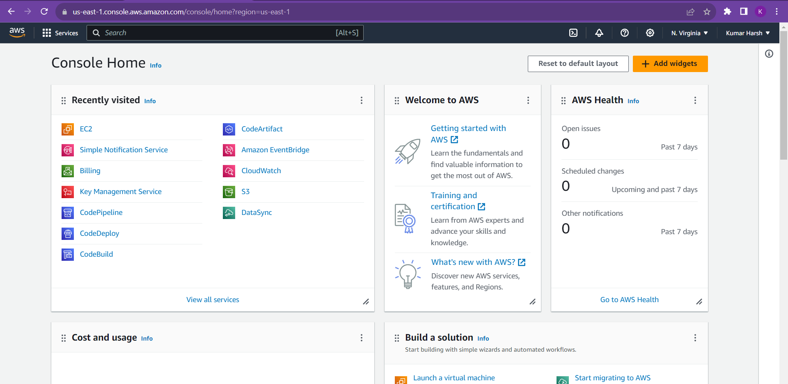

## Creation of AWS EC2 Instances
* Sign Up to your AWS Free tier Account . The AWS Management Console Will Appear.

  

* In the search Panel,Type Ec2 to search for the Ec2 Service.

  

* Click on Ec2 to go the Ec2 Console

  

* Go to Instances and click on Launch Instances.
 
  

* Enter your Instance Name.

  

* Give AMI(template for the OS) for your Server .

  

* Specify the instance Type (Required for the CPU and Storage you will use) .

  

* Create a New keypair which is basically required to ssh into the server remotely . Use any name of your choice and let the rest configuration as they are .

  

* Configure the Network Setting to use a Security Group with allow all Configuration as This is just a personal project and we want Convinience while accessing it .

  

* Configure the storage Capacity and Launch the Instance

  

* Leave the remaining Advanced Configurationas they are and Click on Launch Instance . We Can also specify the number of Instances to be created in the Right panel if we want more Instances with similar Configurations as we do for a cluster Setup.

